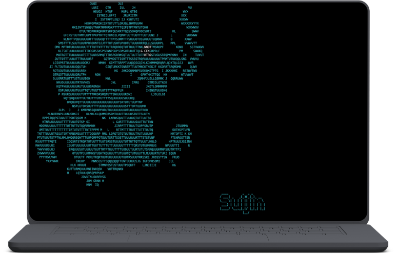
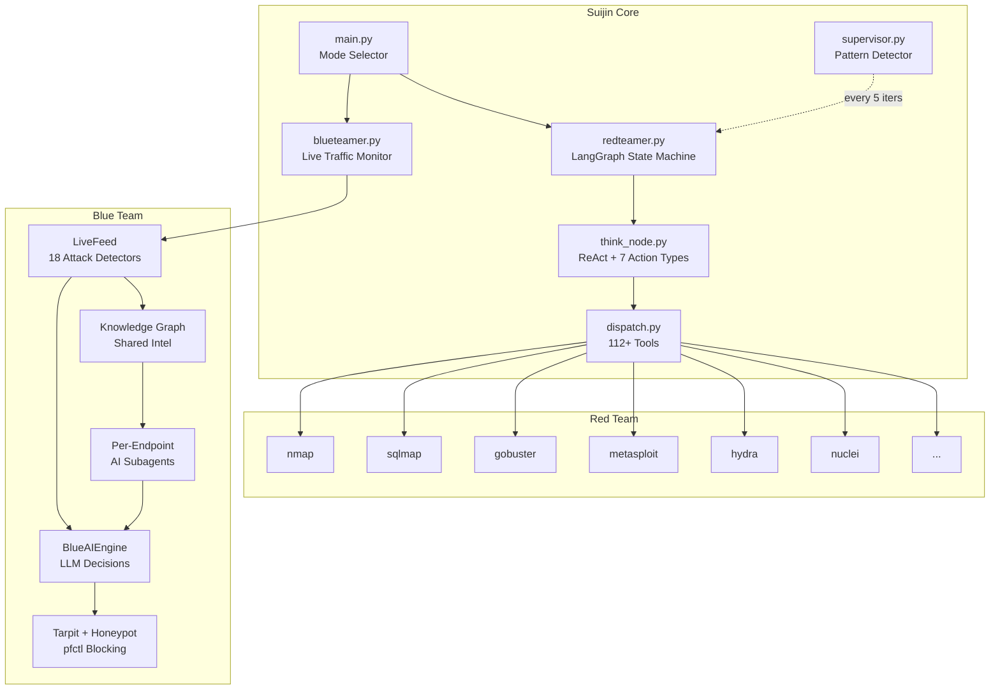

<h3 align="center">v5.3.0</h3> 
<p align="center">

</p>
<h1 align="center">Suijin</h1>


<p align="center">
  
  
  
</p>

Suijin is a dual-mode autonomous security platform: a **Red Team** agent that
chains reconnaissance -> exploitation -> reporting over a LangGraph state machine,
and a **Blue Team** agent that monitors live HTTP traffic, detects attacks, and
responds with deception, blocking, and source patching. Both modes share one
toolkit, one knowledge base, and one knowledge graph.


> **LEGAL DISCLAIMER**: This tool is intended for **authorized security
> testing**, **educational purposes**, and **research only**. Never use this
> system to scan, probe, or attack any system you do not own or have explicit
> written permission to test. Unauthorized access is **illegal**. By using this
> tool you accept full responsibility for your actions.

---

## What's Next

The v5.3 line is the active surface (engagement console UI, authorization
workflow, field-hardened agent). What's being built next:

| Priority | Thing | Status |
|---|---|---|
| 1 | **Blue-team SOC loop** — the process_event pipeline: enrich (identity, assets), incidents with lifecycle, identity-level containment, retention + retro-hunt; headless `suijin blue` | wave A foundations landed; loop waves queued |
| 2 | **Tool packs round 3** — cloud enum depth, AD/kerberos chains, mobile statics (+30) | queued |
| 3 | **Marketplace community index** — the decentralized pack index goes live (hash-pinned installs already ship) | queued |

> **Desktop app (deprecated):** the Tauri desktop client and its gateway
> API shipped as a technical preview in v5.1.0 and are currently
> **not under active maintenance** — the gateway module and desktop code
> are retained in-tree so the surface can be revived later; the console
> UI is the supported operator interface.
| 4 | **`suijin bench`** — graded lab runs, agent performance tracked per release | queued |

Everything above builds on the stable core without churn: the kernel,
module boundaries, prompt budget, and catalog parity are enforced
contracts.

---

## Table of Contents

1. [Requirements](#requirements)
2. [Installation](#installation)
3. [CLI Reference](#cli-reference)
4. [First Engagement](#first-engagement)
5. [Configuration](#configuration)
6. [LLM Providers](#llm-providers)
7. [Knowledge Base](#knowledge-base)
8. [Agent Workspace](#agent-workspace)
9. [Architecture](#architecture)
10. [Red Team Reference](#red-team-reference)
11. [Blue Team Reference](#blue-team-reference)
12. [Built-in Labs](#built-in-labs)
13. [Testing](#testing)
14. [Project Layout](#project-layout)
15. [Troubleshooting](#troubleshooting)
16. [Glossary](#glossary)
17. [Contributing & Credits](#contributing--credits)

---

## Requirements

| Requirement | Details |
|:------------|:--------|
| Python | 3.10+ (3.14 tested) |
| OS | macOS, Linux, Windows |
| LLM API key | Optional — heuristic mode works without one |

---

## Installation

### One command (macOS / Linux)

```bash
curl -fsSL https://raw.githubusercontent.com/0xwi11iam/Suijin/main/install.sh | bash
suijin doctor     # verify the environment
suijin selftest   # offline smoke test (no network, no API keys)
suijin            # launch the interface
```

The installer clones into `~/.suijin/repo`, creates an isolated virtualenv, and
drops a `suijin` launcher on your PATH. Environment overrides:
`SUIJIN_INSTALL_DIR`, `SUIJIN_BIN_DIR`, `SUIJIN_REPO`, `SUIJIN_NO_PATH_EDIT`.
A Medusa-era `~/.medusa` installation is migrated automatically on first
install, and the old `MEDUSA_*` overrides still work.

### pipx / uv (installable package)

```bash
pipx install suijin        # or: uv tool install suijin
suijin doctor
```

The wheel ships every core tool, the prompts/skills assets, and the built
web console. The optional module packs under `Modules/` need a repo
checkout — clone the repo and run from source for the full toolkit.

### Manual

```bash
git clone https://github.com/0xwi11iam/Suijin.git && cd Suijin
python3 -m venv .venv && source .venv/bin/activate
pip install -r suijin/requirements.txt
python3 suijin/main.py
```

### Dev install (live local copy)

Run the installer from inside your checkout — the first question offers
**normal** vs **dev**; from a checkout, dev is the default (press Enter):

```bash
./install.sh            # -> install type [dev] -> live symlink to THIS tree
./install.sh --dev      # non-interactive dev install
```

`~/.suijin/repo` becomes a symlink to your working copy — source edits are
live, no reinstall needed.

### Docker (turnkey)

```bash
docker compose run --rm suijin                 # interactive agent
docker compose run --rm suijin version         # any CLI verb
docker compose down                            # state survives (named volume)
```

The workspace is a **named volume** (`suijin_workspace`): outputs, the
knowledge base, caches, and operator configs survive container
recreation. The image bakes the full Kali toolset plus pip extras
(impacket, dnsrecon, wafw00f, dirsearch, medusa), health-checks itself
with `suijin doctor`, and needs only `config.json` mounted read-only.

---

## Extending Suijin — the four rungs

| Rung | You write | You get | Effort |
|---|---|---|---|
| **Skill** | `suijin/skills/foo.md` | boots into the agent's prompt | 30 seconds |
| **Addon** | `suijin/addons/foo/main.py` — plain functions | auto-registered agent tools | 2 minutes |
| **Pack** | `suijin module init foo` (scaffolded) | tools + skill doc + kernel unit | 5 minutes |
| **Module** | plugin.json + lib/ (first-party) | full lifecycle + services | real work |

Skills and addons need zero boilerplate — drop the file and reboot.
`suijin module adopt foo` graduates an addon into a full pack. Details
and examples: `developer.md`.

---

## CLI Reference

`suijin` bare launches the Rich TUI. Every subcommand below is
**non-interactive, offline, and scriptable** (exit 0 = healthy). The TUI's
**Operator Tools** menu (option 4) exposes the interactive ones — scope
editor, approvals console, battle, debrief, replay — so nothing stays
hidden behind CLI flags.

| Command | What it does |
|:--------|:-------------|
| `suijin` | Launch the classic Rich TUI (Red / Blue / Settings) |
| `suijin doctor` | Full environment check: python, deps, binaries, config, modules, KB, workspace |
| `suijin selftest` | Offline smoke test: imports, KB gating, workspace anchors, sandbox, boundaries |
| `suijin status` | One-page summary: provider, KB, workspace, modules, lab port |
| `suijin version` | Release, codename, python, platform, package path |
| `suijin env` | API key presence by name — values are never printed |
| `suijin tools` | All 265 agent tools with availability (missing binaries marked) |
| `suijin market` | Pack marketplace: search / install / update from any index URL |
| `suijin engage` | Apply an engagement template to a target (recurring via schedule) |
| `suijin modules` | Loaded module packs with tool counts and dependencies |
| `suijin skills` | Agent-editable attack/defense skills |
| `suijin config show` | Effective config (defaults merged), secrets redacted |
| `suijin config validate` | Pydantic validation of `config.json` + `blue_config.json` (exit 1 on failure) |
| `suijin workspace` | Workspace layout, per-directory usage, symlink health |
| `suijin reports` | Engagement reports in `suijin_agent/reports/` (newest first) |
| `suijin sessions` | Saved engagement sessions with objectives |
| `suijin labs` | Built-in labs: list ports / `run` a capability campaign |
| `suijin export` | Chain-of-custody evidence bundle: zip + SHA-256 manifest (`--with-creds`, `--verify <zip>`) |
| `suijin debrief` | Engagement analytics from audit trails (`-v` for per-engagement detail) |
| `suijin replay` | Step through an engagement timeline (`--list`, `--file`, `--export-md`) |
| `suijin eval` | Replay recorded traffic through the blue detector: precision/recall/F1 + threshold sweep |
| `suijin spar` | Sparring mode: detector practice volley vs stored baseline, regression-gated |
| `suijin battle` | Purple team: scripted red vs pattern blue on the lab — live scoreboard |
| `suijin bench` | Graded lab benchmark: agent vs lab, flag/tool/cost score per release (`--lab`, `--live`, `--history`) |
| `suijin authorize <domain>` | Put bug-bounty authorization on file — renders in every engagement order (`--program`, `--id`, `--page`, `--list`, `--remove`) |
| `suijin bb-scope <url>` | Bind a bug-bounty program page's scope (advisory) via bugscope — agent self-verifies with `scope_search` |
| `suijin pack build <dir>` | Seal a pack into a shareable `.sjm/.sja/.sjp` archive (tool table + dev note + SHA-256 seal) |
| `suijin install <file.sj?>` | Wizard install of a sealed package: attribution, dev note, safety scan, tool table (`--yes`, `--allow-unsafe`) |
| `suijin kb read <path>` | Dump a **full (untruncated) KB document** from its tarball; `suijin kb diff` checks index vs cache staleness |
| `suijin pull cve` | Mirror the CISA KEV catalog (no API key) — powers offline `search_cve` + actively-exploited badges |
| `suijin creds` | Encrypted credential vault: `init` / `list [--reveal]` / `add` / `get` / `export [--plain]` |
| `suijin dossier <target>` | Per-target intel: KG constraints, failed techniques, engagement + report history |
| `suijin timeline` | Unified chronological view across audits, sessions, and reports |
| `suijin watch` | Live-score the traffic log as it grows (`--traffic <file>`) |
| `suijin clean` | Workspace cleaner — dry-run by default, `--apply` archives then deletes |
| `suijin rules` | Custom detector rules: `validate` (lint) / `list` |
| `suijin policy` | Engagement policy: `check` (lint) / `show` — opt-in, enforced at dispatch |
| `suijin providers` | Probe configured providers with a tiny live request (`--all` for every keyed provider) |
| `suijin module` | Module SDK: `init <name>` scaffolds, `validate <name>` lints manifest + imports |
| `suijin skills` | Skill list + versioning: `history` / `diff` / `rollback` (snapshots on every agent edit) |
| `suijin notify` | Operator notifications: `send 'msg'` / `test` (file/command/macOS channels; battle fires on flags & blocks) |
| `suijin compliance [eng]` | Map engagement findings to CWE / OWASP Top-10 / MITRE ATT&CK (newest engagement by default) |
| `suijin approvals` | HITL console: `list` blocked actions, `approve`/`deny <id>` for the session, `clear` resets verdicts |
| `suijin scope` | **Burp-style scope TUI**: include/exclude lists, subdomain matching, unresolvable toggle, enforcement on/off |
| `suijin panic` | Kill every Suijin process + clear live state NOW (`--dry-run` previews) |
| `suijin pull kb` | Download + index the knowledge base (**enables** KB features) |
| `suijin pull kb --status` | Offline: what's indexed, per-source counts, build age |
| `suijin pull kb --list` | Available sources with size warnings |
| `suijin pull kb --sources <names>` | Pull a subset (rebuilds the DB with just those) |
| `suijin pull kb --force` | Re-download even if tarballs are cached |

Examples:

```bash
suijin status && suijin labs
suijin pull kb --sources hacktricks gtfobins   # skip the 300 MB SecLists pull
suijin config validate || echo "fix config.json"
suijin export && suijin export --verify suijin_agent/exports/<latest>.zip
suijin battle                                   # red vs blue, live scoreboard
```

---

## Engagement Lifecycle Tools

### Evidence export (`suijin export`)

One command packs everything an engagement produced into a tamper-evident
zip: reports, audit trails, sessions, blue state, dossiers, both knowledge
graphs, and the redacted config. Every file is SHA-256-hashed in
`manifest.json` alongside a `custody.json` chain-of-custody record (who,
when, host, commit). `suijin export --verify <zip>` re-hashes the bundle
and flags any mismatch, missing, or unlisted file. Credentials are excluded
unless `--with-creds` is passed explicitly.

### Debrief (`suijin debrief`)

Analytics over `suijin_agent/audit_trails/*.json`: per-engagement table
(actions, success/fail, findings, cost, duration), cross-engagement fleet
trends (avg duration, findings per engagement, top tools), and with `-v`
per-engagement severity/tool breakdowns including which tools keep failing.

### Replay (`suijin replay`)

Interactive timeline over any engagement's audit trail: space to play/pause,
arrows to scrub (10-step jumps on up/down), +/- for speed, `q` to quit.
Panels show the thought, the action + args, and the full observation per
step. `--export-md OUT` writes the complete shareable transcript;
non-TTY contexts print it directly.

### Detector tuning harness (`suijin eval`)

Replays recorded traffic (`--traffic`, default the live blue log) through
the REAL production scorer, labels each entry with strong heuristic
attack/benign rules (or your own `labels.jsonl` — `{"label": "attack",
"any": ["substr"]} rules, first match wins), and reports
precision/recall/F1 at the production threshold plus a full sweep:

```
@ threshold 5 (production default):  P 0.80  R 0.57  F1 0.67  (TP 4 FP 1 TN 4 FN 3)
  thr    prec  rec   F1    TP FP TN FN
   2   0.86  0.86  0.86   6  1  4  1
  ...
  best F1 at threshold 2 — tune via blue_config.json scorer.suspicious_threshold
```

This harness found and fixed real detector gaps (body-only scanning missed
all query-string attacks; XXE bodies and X-Admin headers were never
scanned) — production recall on battle traffic went 0.14 -> 0.57 at the
same threshold with precision held at 0.80.

### Battle mode (`suijin battle`)

Purple-team in one command: boots the blue_target lab, clears blue state,
then runs a scripted red campaign (recon -> auth attacks -> access attacks ->
injection chain -> final sweep) while an embedded blue watchdog tails the
live traffic log, scores every request with the production scorer, and
deploys real defenses — tarpits the lab actually enforces (measurable
latency), network blocks that deny subsequent red requests. Live Rich
scoreboard during the fight; markdown battle report saved to
`suijin_agent/reports/`. Scoring: red = 100/flag + 25/attack-class,
blue = 10/detection + 25/tarpit + 50/block. Flag captures and blocks fire
`suijin notify` channels when configured.

### Agent capability upgrades (v2.10)

New agent tools, all offline:

| Tool | What it does |
|:-----|:-------------|
| `kb_read` | Full untruncated KB documents (the FTS copy is capped); substring paths OK |
| `target_dossier` | Per-target intel: blocked patterns, failed techniques, history — consult before re-attacking |
| `mutate_wordlist` | Seed words -> leet/years/suffixes wordlist (cap 50k) into `suijin_agent/wordlists/` |
| `cewl_words` | Harvest a wordlist from a target page's visible words |

`suggest_exploit` now fuzzy-matches GTFOBins bins (`finnd` -> `find`), and
`recon_chain` automatically appends offline exploit leads for fingerprinted
services. `search_cve` falls back to the local KEV mirror when NVD is
unreachable. Provider failover: set `"fallback_providers": ["deepseek"]`
in config — hard failures roll to the next provider.

### Governance (opt-in)

- **Policy** (`suijin/policy.json`, `suijin policy check|show`, edited via
  the `suijin scope` TUI): blocked tools, blocked arg regexes, and
  Burp-style target scoping — include + exclude lists (exclude wins over
  include), subdomain matching toggle, `*.domain` wildcards,
  allow-unresolvable-hosts — enforced at the dispatch chokepoint.
  **No file = no enforcement** — existing engagements are untouched;
  intel-only tools (dossier, KB, CVE search) are never scope-gated.
- **Detector rules** (`suijin/detector_rules.json`, `suijin rules
  validate|list`): custom regex detectors (field: body/path/ua/headers,
  weight 1–10) merged into the eval harness and battle watchdog.
- **Credential vault** (`suijin creds`): PBKDF2-HMAC-SHA256 + tagged
  keystream encryption at rest, imports + shreds legacy
  `credentials.json`, redacted exports.

### Ops utilities (v2.10)

`suijin providers` (live provider probe), `suijin module init|validate`
(module SDK), `suijin skills history|diff|rollback` (every agent
self-edit is snapshotted), `suijin labs run` (boot + probe every lab ->
capability matrix), `suijin watch` (live-scored traffic tail),
`suijin timeline` (unified artifact history), `suijin clean` (dry-run
first workspace cleaner), `suijin notify` (file/command/macOS channels).

---


## First Engagement

### Red Team

```bash
# Terminal 1: start a lab
python3 suijin/lab/blue_target/vulnerable_app.py        # :5906

# Terminal 2: launch and point the agent at it
python3 suijin/main.py   # choose [1] Red Team, target http://127.0.0.1:5906
```

The agent runs the chain autonomously — port scan, endpoint discovery,
directory brute-force, CVE lookup, exploitation — logging every step to the
audit trail and `.notes/`, and finishes with a report in
`suijin_agent/reports/`.

### Blue Team

```bash
# Terminal 1: Blue Team starts and watches the built-in lab
python3 suijin/main.py   # choose [2] Blue Team -> 2 (built-in lab :5906)

# Terminal 2: attack it once the baseline locks (after 25 requests)
python3 suijin/lab/blue_target/attack_simulator.py
# or by hand:
curl -X POST http://127.0.0.1:5906/auth/login \
  -H "Content-Type: application/json" \
  -d '{"username":"admin'"'"' OR '"'"'1'"'"'='"'"'1","password":"x"}'
```

### Purple teaming

Run both at once: Blue defends the lab while Red attacks it. The knowledge
graph is shared, so every flag claimed and every defense deployed is visible
to both sides.

---

## Configuration

Configuration lives in **`suijin/config.json`** (red team) and
**`suijin/blue_config.json`** (blue team). API keys live in `suijin/.env` or
environment variables — **never in config.json**. Validate with
`suijin config validate`; inspect with `suijin config show` (secrets redacted).

### `suijin/config.json` — key reference

| Key | Default | Meaning |
|:----|:--------|:--------|
| `provider` | `"deepseek"` | LLM provider id (see [Providers](#llm-providers)) |
| `deepseek_model` | `"deepseek-v4-flash"` | DeepSeek model |
| `zai_model` | `"glm-5.3"` | Z.ai GLM model |
| `zai_endpoint` | `"coding"` | Z.ai billing surface: `"coding"` (Coding Plan) or `"paas"` (pay-as-you-go) |
| `gemini_model` | `"gemini-2.5-flash"` | Gemini model |
| `anthropic_model` | `"claude-opus-4-7"` | Anthropic model |
| `temperature` | `0.4` | Sampling temperature (0.0–2.0) |
| `max_tokens_per_request` | `8000` | Per-call token ceiling |
| `max_iterations` | `100` | Agent loop cap |
| `supervisor_interval` | `5` | Supervisor runs every N iterations |
| `supervisor_model_id` | `"Qwen/Qwen2.5-3B-Instruct"` | Supervisor model (HF) |
| `cost_alert_usd` / `cost_budget_usd` / `cost_hard_cap_usd` | `0.25` / `1.0` / `2.0` | Cost guardrails |
| `mode_hitl` | `false` | Human-in-the-loop: blocks non-recon tools until approved |
| `mode_guardrail` | `false` | Blocks destructive shell commands (rm/mv/chmod/kill) |
| `mode_deploy_subagent` | `true` | Allow parallel subagents |
| `mode_audit_trail` | `true` | Zero-truncation JSON/MD audit logging |
| `subagent_count` | `2` | Max parallel subagents (1–5) |
| `proxy_url` | — | Outbound proxy for all tool HTTP traffic |
| `metasploit_rpc_host` / `_port` / `_ssl` | `127.0.0.1` / `55553` / `false` | msfrpcd connection |

The launcher banner and Thinking spinner resolve the display model per
provider (`<provider>_model`; HuggingFace uses `final_model_id`).

Unknown keys are caught at startup by Pydantic validation; `zai_endpoint`
accepts only `coding`, `paas`, or a full custom base URL.

### `suijin/blue_config.json` — key reference

```json
{
    "traffic_normalization_turns": 25,
    "scorer":       {"critical_threshold": 8, "suspicious_threshold": 5},
    "watchers":     {"max_per_endpoint": 3, "health_check_interval": 30},
    "deception":    {"auto_honeypot": true, "auto_tarpit": true,
                     "tarpit_delay_seconds": 8, "shadow_redirect_threshold": 8},
    "response":     {"auto_block_critical": true, "max_blocks_per_hour": 50},
    "hotfix":       {"auto_patch_critical": false, "silent_patch_mode": true},
    "cost":         {"daily_budget_usd": 5.00, "max_llm_calls_per_minute": 20}
}
```

---

## LLM Providers

| Provider | Models | Env var |
|:---------|:-------|:--------|
| **Z.ai (GLM)** | `glm-5.3` (default), `glm-5-turbo`, `glm-4.7` | `ZAI_API_KEY` |
| **DeepSeek** | `deepseek-v4-flash`, `deepseek-v4-pro` | `DEEPSEEK_API_KEY` |
| **HuggingFace** | Qwen, GLM, DeepSeek via TGI | `HF_TOKEN` |
| **Gemini** | `gemini-2.5-pro`, `gemini-2.5-flash` | `GEMINI_API_KEY` |
| **Anthropic** | `claude-opus-4-7`, `claude-sonnet-4-6`, `claude-haiku-4-5` | `ANTHROPIC_API_KEY` |
| **AMD** | via `amd_config.endpoint` | `AMD_API_KEY` |

`NVD_API_KEY` (optional) raises NVD rate limits for the `search_cve` tool.

### Z.ai: Coding Plan vs pay-as-you-go

Z.ai serves **two separate chat-completions endpoints** that accept the same
`ZAI_API_KEY` but bill differently. Pick with `zai_endpoint` in
`suijin/config.json` (Settings TUI -> provider `zai` -> `zai_endpoint`, or
`suijin config validate` catches typos):

| `zai_endpoint` | Base URL | Billing |
|:---------------|:---------|:--------|
| `"coding"` **(default)** | `https://api.z.ai/api/coding/paas/v4` | GLM Coding Plan subscription (Lite/Pro/Max) — burns plan **credits**, never dollars. Models: `glm-5.3`, `glm-5-turbo`, `glm-4.7` (older GLM ids auto-route to glm-5.3). |
| `"paas"` | `https://api.z.ai/api/paas/v4` | Pay-as-you-go — per-token **USD** billing, full GLM catalogue. Choose this only if you don't have a Coding Plan. |

A Coding Plan key hitting the `paas` endpoint (or vice versa) returns **403** —
Suijin detects this and prints the exact fix instead of retrying. `suijin
doctor` and `suijin status` show the active endpoint. A full custom base URL
(e.g. a proxy) is also accepted as `zai_endpoint`.

Docs: <https://docs.z.ai/devpack/tool/others>

---

## Knowledge Base

`suijin pull kb` **downloads and indexes** the offline security knowledge base
into one SQLite FTS5 database — that act **enables** all KB features. Until you
run it, they stay **disabled** (`search_kb` reports DISABLED, the tool catalog
lists it under a disabled section, and the agent asks the operator to run the
pull).

```bash
suijin pull kb              # download all sources and compile to SQLite FTS5
suijin pull kb --status     # what's indexed, per-source counts, build age
suijin pull kb --list       # available sources (incl. size warnings)
suijin pull kb --sources hacktricks gtfobins   # subset (replaces the DB)
suijin pull kb --force      # ignore cached tarballs
```

| | |
|:--|:--|
| **Sources** | HackTricks, PayloadsAllTheThings, GTFOBins (`GTFOBins.github.io` — path-pattern matched under `_gtfobins/`, alias stubs like `awk -> mawk` resolved), LOLBAS, OWASP Cheat Sheets, SecLists (`~300 MB`, warned before download) |
| **Storage** | `suijin/kb.sqlite3` (FTS5, BM25-ranked) + `suijin/kb_cache/` tarballs — always inside the repo, never bundled |
| **Agent tool** | `search_kb` — ranked results with source + snippet, offline. Optional `source:<name>` filter (e.g. `"source:gtfobins awk sudo"`) and `limit` 1–20 (default 5) |
| **Honest status** | Only sources that actually indexed docs are counted; a source that downloads but matches 0 files is a **failure** with a pattern hint, never a silent gap |
| **Resilient pulls** | 3 download attempts per ref with backoff, stale `.part` files discarded (never resumed), progress logging every 50 MB, 600 s timeout |

The agent's attack rhythm is KB-first: *fingerprint -> search_kb -> search_cve ->
attack*. One dead source never kills a pull — failures are skipped, reported,
and retryable with `--sources <name>`. `suijin doctor` shows per-source doc
counts and a STALE warning when the build is older than 30 days.

### Agent toolkit built on the KB

Beyond `search_kb`, the agent gets seven offline tools (all work without any
API key; the four marked  need the KB built):

| Tool | What it does |
|:-----|:-------------|
|  `suggest_exploit` | Fingerprinted service -> exact GTFOBins privesc page + HackTricks + PayloadsAllTheThings leads, offline |
|  `find_wordlist` | Keyword -> matching SecLists wordlists, **materialized** into `suijin_agent/wordlists/` ready for `ffuf -w` |
|  `extract_payloads` | Pulls runnable code blocks from KB docs into `suijin_agent/payloads/` |
|  `kb_stats` | Per-source inventory, build age, failed sources |
| `wordlist_tool` | Merge / dedupe / length-filter wordlists |
| `mine_failures` | Clusters `failure_db.json` into technique/reason patterns to stop repeating |
| `anonymize_report` | Scrubs IPs/emails/tokens/JWTs/keys from a report before sharing (localhost + `FLAG{}` preserved) |

`search_kb` also supports **phrase queries**: quoted spans match adjacent,
in-order words — `"union select"` won't match `select ... union`.

---

## Agent Workspace

All agent artifacts live in **one** root-level `suijin_agent/`:

```
suijin_agent/
├── reports/         engagement reports (markdown/html/json)
├── audit_trails/    zero-truncation JSON/MD audit logs
├── sessions/        saved sessions for replay
├── blue_state/      blue-team session state
├── dossiers/        attacker profiles
├── outputs/         background-job logs + offloaded tool output
├── payloads/ ── scripts/ ── sandbox/
├── evidence/ ── evidence_chains/ ── goals/
├── credentials.json discovered credentials
└── SOUL.md          agent persona file
```

The layout is **self-repairing**: on startup, `ensure_workspace_layout()`
(`suijin/modules/platform/lib/workspace.py`) merges any legacy real `suijin/suijin_agent/`
directory up into the root workspace and replaces the inner path with a
symlink `-> ../suijin_agent`. All writes go through one anchor
(`WORKSPACE_DIR`); absolute paths outside the workspace and `/tmp` allowlist
are rejected; the shell sandbox lives at `suijin_agent/sandbox`. KB artifacts
stay strictly in `suijin/` — never inside the workspace.

Check it: `suijin workspace` (usage + symlink health), `suijin selftest`
(boundary + sandbox containment invariants).

---

## Architecture



Dual-mode summary:

| | Red Team | Blue Team |
|:--|:--|:--|
| **Goal** | Discover, verify, exploit vulnerabilities; claim flags; produce a report. | Detect, deceive, block, and patch attackers; maintain defense logs and attacker profiles. |
| **Driver** | LangGraph state machine + supervisor + parallel subagents. | 18 pre-AI detectors + per-endpoint AI subagents + response ladder. |
| **Tools** | nmap, gobuster, feroxbuster, amass, sqlmap, hydra, Metasploit, john, CVE/KB search. | Tarpit, network block, canary tokens, patch engine, KG profiling. |
| **Output** | Findings, flags, exploit chains, audit trail, attack tree. | Incident feed, defense log, attacker history, patches applied. |

---

## Red Team Reference

### Pipeline

`recon -> vuln discovery -> exploit -> escalate -> flag -> report`, driven by the
think node (ReAct) over a LangGraph state machine. Every step's tool call and
raw output is persisted to the audit trail.

### Live command box (during a run)

While the agent streams, an always-on command line is active — type at any
time, the run never stops:

| Command | Effect |
|:--------|:-------|
| `/state` | Live agent state (phase, iterations, messages) |
| `/note <text>` | Write an engagement note immediately |
| `/kb <query>` | Quick knowledge-base search (top 3) |
| `/cost` | Token + spend tally so far |
| `/approvals` | HITL queue -> `/approve <id>` / `/deny <id>` decide mid-run |
| `/scope` | Current target scopes |
| `/audit` / `/sessions` | Audit summary / saved sessions |
| `/report` | Generate + save the report without stopping |
| `/pause` | Drop into guidance mode after the current step |
| `/panic` | Kill everything now |
| plain text | Queued as operator guidance, delivered at the next pause |

`/help` lists them all. Commands are also available in pause mode (Ctrl+C).

### Supervisor — zero-cost oversight

Runs silently every 5 iterations (configurable). Pure pattern matching — no
LLM calls, zero API cost.

| Pattern | Trigger | Intervention |
|:--------|:--------|:-------------|
| Loop | Same tool 3x consecutively | "Try a DIFFERENT approach. Switch tool or attack vector." |
| Bookkeeping Trap | 4+ turns of notes/jobs | "STOP documenting. START exploiting NOW." |
| Missed Flag | `FLAG{...}` found but not claimed | "Claim it IMMEDIATELY with claim_flag." |
| Unfollowed Vuln | Vuln discovered, no follow-up | "Test the vulnerability NOW. Don't pivot." |
| Failing Subagents | 3+ subagents returned empty | "Subagents keep failing. Run the task yourself." |
| Stall | 5 turns with no new info | "Radically change approach or generate report." |

### Subagents

```json
{"action": "deploy_subagent",
 "subagent_task": "SQLi on /login || XSS on /search || SSTI on /profile",
 "thought": "Parallelizing attack vectors across all endpoints"}
```

| Property | Value |
|:---------|:------|
| Max concurrent | 3 (semaphore) |
| Max steps | 5 per subagent |
| LLM timeout | 45 s |
| Tool timeout | 60 s |
| Total timeout | 95 s |
| Crash isolation | Yes — one failure doesn't kill others |

### Runtime controls

| Command | Context | Action |
|:--------|:--------|:-------|
| `Ctrl+C` | During run | Pause agent, enter guidance mode |
| `/report` | Paused | Force-generate report + end audit |
| `/audit` | Paused | Print current audit trail |
| `/state` | Paused | Print agent state (phase, iterations, cost) |
| `/sessions` | Paused | List saved sessions for replay |

---

## Blue Team Reference

### Request processing — three tiers

| Tier | Trigger | AI Cost | Response |
|:-----|:--------|:--------|:---------|
| **NORMAL** | Matches known-safe baseline | $0.00 | Logged for audit only |
| **ANOMALOUS** | Deviates from baseline, no attack pattern | ~$0.001 | AI classifies -> baseline or INVESTIGATED |
| **INVESTIGATED** | Attack pattern detected or AI flagged | ~$0.002 | AI decides: BLOCK / DECEIVE / PATCH / LOG / REDIRECT |

**Baseline learning:** the first 25 requests build pattern profiles
(`SmartNormalizer` hashes by method, normalized path, param keys, body
structure). After 25 requests the baseline locks and AI analysis activates.

### Pre-AI pattern detector — 18 signatures

| # | Pattern | Weight | Example |
|:-:|:---------|:--:|:--------|
| 1 | SQL Injection | 5 | `admin' OR '1'='1`, `UNION SELECT` |
| 2 | SQL Injection (Blind) | 5 | `' OR SLEEP(5)`, `BENCHMARK()` |
| 3 | XSS | 5 | `<script>`, `onerror=`, `javascript:` |
| 4 | Path Traversal | 4 | `../../etc/passwd` |
| 5 | SSRF | 5 | `169.254.169.254`, `metadata.google.internal` |
| 6 | Command Injection | 5 | `; id`, `` `whoami` ``, `$(...)` |
| 7 | SSTI | 4 | `{{7*7}}`, `${7*7}` |
| 8 | XXE | 5 | `<!ENTITY xxe SYSTEM` |
| 9 | JWT Attack | 3 | alg:none, key confusion |
| 10 | Deserialization | 5 | `pickle.loads`, `yaml.load(` |
| 11 | LDAP Injection | 4 | `(&(uid=*)(|` |
| 12 | NoSQL Injection | 4 | `{"$ne": null}` |
| 13 | Scanner User-Agent | 4 | sqlmap, Nikto, Burp |
| 14 | Mass Assignment | 4 | `"role":"admin"` |
| 15 | Auth Bypass Header | 5 | `X-Admin: true` |
| 16 | Brute Force | 3 | Hydra/Suijin UA, repeated attempts |
| 17 | File Inclusion | 5 | `php://filter`, `data://text` |
| 18 | GraphQL Attack | 3 | `__schema`, deep nesting |

Score threshold: **5**. Repeat offenders gain +1 effective score per flag —
a persistent attacker escalates from DECEIVE to BLOCK automatically. The
pattern detector has veto power even when the AI classifies benign.

### AI decision engine

For every anomalous/investigated request the engine builds a prompt with the
full request, attacker history from the knowledge graph, the endpoint's
handler source code, and subagent intelligence, and receives a structured
decision:

```json
{
  "verdict": "FLAGGED",
  "score": 9,
  "action": "DECEIVE",
  "attack_analysis": "SQL injection in username field using OR 1=1 bypass",
  "attacker_assessment": "Automated scanner, low skill",
  "reasoning": "Classic SQLi. Endpoint uses raw string concatenation.",
  "commands_to_run": ["echo '{\"127.0.0.1\":{\"delay\":5}}' > /tmp/blue_tarpit.json"],
  "code_changes": [
    {"file": "vulnerable_app.py", "change": "Parameterize SQL query",
     "new_content": "conn.execute('SELECT * FROM users WHERE username=?', (username,))"}
  ]
}
```

Commands are executed, code changes written to the target filesystem, and
everything recorded in the knowledge graph. Escalation doctrine: novel
attacker -> DECEIVE (gather intelligence); repeat offender -> BLOCK; critical
vuln (RCE/data exfil) -> BLOCK + PATCH; benign anomaly -> LOG and baseline. If
the AI is unreachable (bad key, quota, network), pattern-based fallback
defense still deploys — defense never depends on the AI being available.

### Deception arsenal

- **Tarpit** — flagged IPs get real `time.sleep(delay)` per request via
  `/tmp/blue_tarpit.json` (measured: 0.018 s normal -> 5.8 s at score 6 ->
  8.0 s at score 10). Expires after 30 minutes.
- **Network blocking** — score 8+ triggers `pfctl -t blue_blocked -T add <IP>`
  (iptables fallback on Linux).
- **Honeypots** — decoy admin users with canary API keys, phantom debug
  tokens, decoy config endpoints.
- **Codebase patching** — full-file rewrites of vulnerable handlers;
  silent-patch mode keeps the original endpoint as a trap.

### Session knowledge graph

`/tmp/blue_kg.json` — shared across subagents and the main engine:
**attacker** nodes (IP, first seen, flags, tools), **attack** nodes (path,
type, score, payload), **defense** nodes (tarpit/block/patch + detail), and
**intelligence** nodes (subagent findings). `get_attacker_history(ip)` feeds
the AI full context so responses escalate with repetition.

### Runtime commands

| Command | Action |
|:--------|:-------|
| `Ctrl+C` | Pause feed, enter command mode |
| `/state` | Endpoints, subagents, requests, baseline status, AI cost |
| `/report` | KG summary: top attackers, attack/defense counts |
| `/health` | System health check |
| `/quit` | End session, save state |

---

## Built-in Labs

Eight deliberately vulnerable Flask apps ship in `suijin/lab/` — practice
without touching anything you don't own. `suijin labs` lists them live with
ports and launch commands.

| Lab | Port | Launch | Focus |
|:----|:-----|:-------|:------|
| cloud_iam_lab | 5900 | `python3 suijin/lab/cloud_iam_lab/app.py` | AWS IAM misconfigurations |
| api_only_lab | 5901 | `python3 suijin/lab/api_only_lab/app.py` | REST + GraphQL: BOLA, mass assignment, rate-limit bypass |
| oauth_lab | 5902 | `python3 suijin/lab/oauth_lab/app.py` | OAuth 2.0 / OIDC misconfigurations |
| log4shell_lab | 5903 | `python3 suijin/lab/log4shell_lab/app.py` | Log4j RCE |
| wordpress_lab | 5904 | `python3 suijin/lab/wordpress_lab/app.py` | WordPress + vulnerable plugins |
| ad_lab | 5905 | `python3 suijin/lab/ad_lab/app.py` | Simulated AD DC: Kerberos, LDAP, SMB |
| blue_target | 5906 | `python3 suijin/lab/blue_target/vulnerable_app.py` | 25 endpoints, 8 route groups, 15+ vuln classes (below) |
| devops_dashboard | 5700 | `python3 suijin/lab/devops_dashboard/app.py` | Hard RCE lab — multi-step chain required |

### blue_target (:5906) — route groups

| Group | Endpoints | Vulnerabilities |
|:------|:----------|:----------------|
| Auth | `/auth/register`, `/auth/login`, `/auth/refresh`, `/auth/me`, `/auth/reset-password` | SQLi login, mass assignment (role=admin), JWT alg:none, predictable reset tokens |
| Users API | `/api/users`, `/api/users/<id>` | IDOR, no CSRF on delete |
| Search | `/api/search` | SQLi in field name AND value |
| Documents | `/api/documents/<id>/download` | IDOR, path traversal, upload extension bypass |
| Export | `/api/export` | XXE file read |
| Templates | `/api/templates/<name>` | SSTI via `eval()` |
| Execute | `/api/execute` | Command injection (`shell=True`) |
| Coupons | `/api/coupons/redeem` | Race condition (0.5 s window) |
| GraphQL | `/graphql` | Introspection enabled, no depth limit |
| Admin | `/admin`, `/admin/config` | `X-Admin: true` bypass, SSRF webhook |
| Health/Debug | `/health`, `/debug/state` | Info disclosure |
| Landing | `/` | Full endpoint enumeration |

Example attack chain: register as admin (mass assignment) -> admin JWT -> IDOR
user dump -> UNION-inject search -> path-traversal file read -> RCE via
`/api/execute`.

---

## Testing

```bash
python3 -m pytest suijin/tests/ -q          # full suite (offline)
python3 -m pytest suijin/tests/ -m "not ai" # skip live-API tests
```

500+ tests across 16 files — all offline (network mocked, no API keys needed).

| Test file | Covers |
|:----------|:-------|
| `test_cli_commands.py` | All non-interactive CLI verbs: status/version/env/tools/modules/skills/labs/workspace, config show redaction + validate, reports/sessions listings, doctor workspace row |
| `test_zai_provider.py` | Z.ai dual endpoints (coding default / paas / custom URL / 403 guidance), model remapping, retries, pricing, config validation, doctor row |
| `test_kb_tools.py` | find_wordlist (search + tarball extraction), kb_stats, suggest_exploit (GTFOBins alias resolution), extract_payloads, wordlist_tool merge/filter, mine_failures clustering, anonymize_report scrubbing, search_kb phrase queries |
| `test_export_debrief_replay.py` | Evidence bundles (build/verify/tamper/extra-file/creds opt-in/redaction), debrief stats + fleet trends, replay listing/markdown/non-TTY |
| `test_eval_battle.py` | Harness labeling (heuristic + labels.jsonl override), confusion-matrix math, threshold sweep, real-scorer replay; battle score math, watchdog detect/tarpit/block, report rendering |
| `test_kb_v2_and_intel.py` | kb read (full docs, substring, ambiguity), kb diff staleness, fuzzy GTFOBins, KEV mirror + offline search_cve fallback, wordlist mutation + cewl |
| `test_cli_v210.py` | CLI-level exit codes/output for all v2.10 verbs: kb, pull cve, creds, dossier, timeline, watch, clean, rules, policy, providers, module, notify |
| `test_compliance.py` | Compliance mapping: known classes, specificity ordering, snake_case normalization, fallback, summaries, engagement loading, CLI verb |
| `test_red_knowledge_graph.py` | The agent's persistent memory: constraint dedupe + confidence merging, payload-block checks, CVE/bypass queries, corrupt-JSON recovery, record_finding->check_knowledge roundtrip |
| `test_infra_and_defense.py` | Output offloading (thresholds, previews), firewall (validate-before-exec, rule ops, DROP filtering), traffic-log tailing (append/rotation), msf availability probing |
| `test_http_session_tools.py` | Session state (cookies/CSRF/auth), rate-limit tracking (429, Retry-After, domain isolation), UA rotation, http_request with mocked transport |
| `test_import_graph.py` | Import-graph guard: every `suijin.*` import resolves to a real file, entry points importable, pruned packages stay pruned |
| `test_run_commands.py` | Live run-command box: dispatch semantics, every handler (/state /note /kb /cost /approvals /pause …), guidance queue, guarded failures, lifecycle; HITL execute_terminal approval queueing |
| `test_subagents.py` | Blue-team endpoint subagents end-to-end: AI analysis path, no-API fallback scoring from real source files, batch crash isolation, anomaly routing, summaries |
| `test_v210_features.py` | Credential vault (roundtrip/tamper/shred/redaction), dossiers, notify channels, rules + policy (opt-in semantics, scope exemptions, dispatch enforcement), module SDK, provider failover, skill versioning, campaign/watch/timeline/clean, recon hook |
| `test_kb.py` | KB compile (FTS5, caps), path patterns + GTFOBins alias stubs, zero-doc failures, honest status, download retries + `.part` cleanup, `search_kb` filters, catalog gating |
| `test_workspace_layout.py` | Canonical workspace merge + symlink migration, sandbox containment, CWD-independent paths |
| `test_dispatch.py` | Tool routing, guardrails, file ops, CVSS/KEV parsing, jobs |
| `test_state_helpers.py` | State models, parsing, productivity, guardrails, provider routing |
| `test_blue_team.py` | AI engine, feed, scorer, deception, firewall, SOC, tarpit |
| `test_e2e_blue.py` | Live-lab integration: real SQLi -> detection -> tarpit delay |
| `test_graph.py`, `test_integration.py`, `test_core.py`, `test_tools.py`, `test_agent_helpers.py`, `test_ai_calls.py` | State machine, pipelines, guardrails, workspace FS, config loading |

**CI:** GitHub Actions matrix (Python 3.10/3.11/3.12) — pytest + coverage,
pyright, ruff, pip-audit.

---

## Project Layout

```
suijin-security/
├── suijin/                  Python package (the whole backend)
│   ├── cli.py               CLI entry — doctor, selftest, status, pull kb, ...
│   ├── main.py              Rich TUI launcher
│   ├── kb.py                Knowledge base: download, index, FTS5 compile
│   ├── core/                Red + blue engines, config models, state
│   │   ├── redteamer.py     LangGraph red-team driver
│   │   ├── blueteamer.py    Blue-team driver
│   │   └── blue/            Detectors, deception, SOC, subagents, TUI feed
│   ├── tools/               dispatch.py hub + tool modules
│   │   ├── providers.py     LLM providers (Z.ai coding/paas, DeepSeek, ...)
│   │   └── workspace.py     Canonical workspace anchor + layout repair
│   ├── infra/               Job runner, output offload, workspace FS
│   ├── modules/             Module-pack loader
│   ├── prompts/             System prompts + tool registry
│   ├── skills/              Agent-editable skill files
│   ├── nodes/               LangGraph nodes (think, execute, initialize)
│   ├── lab/                 8 deliberately vulnerable Flask apps
│   ├── tests/               500 offline tests
│   ├── kb.sqlite3           Compiled KB (gitignored — build with pull kb)
│   └── kb_cache/            Downloaded tarballs (gitignored)
├── Modules/                 Module packs (Tools/ + Mods/), 49 packs, 93 tools
├── suijin_agent/            THE agent workspace (see Agent Workspace)
├── docs/adr/                Architecture decision records
├── install.sh               One-command installer
├── Dockerfile, docker-compose.yml
├── CHANGELOG.md, CONTRIBUTING.md, SECURITY.md
└── README.md
```

Portability: all paths resolve via `Path(__file__).resolve().parent` — rename
or move the project folder freely. Requirements: `suijin/` and `Modules/` at
the same level; `suijin_agent/` at project root (`suijin/suijin_agent` is a
symlink, auto-repaired at startup).

---

## Architecture — Suijin OS

See **[ARCHITECTURE.md](ARCHITECTURE.md)** — the OS manual: kernel subsystems, boot sequence, tier model, and a copy-paste module recipe (one folder, one manifest, one entry).

### Roadmap (complete)

Suijin is being rebuilt as a modular **operating system for security
automation** — same functionality, same look, same commands throughout;
the internals become snap-in modules. Analogy: kernel + system packages +
bundled apps + installable community software.

### The design (locked)

| Layer | What | Form |
|:------|:-----|:-----|
| **Kernel** | 12 stdlib-only subsystems: contracts (module/tool protocols), context (the "syscall table" handed to every module), events (pub/sub replacing cross-imports), registry (manifest parsing, dependency DAG, tiers), controller (`boot()` scene analysis + management API), jobs, vfs (file-boundary chokepoint), security (declared permissions, enforced once), config (layered merge), health (boot report), journal (rotated ring log), errors | `suijin/kernel/` |
| **Rust core** | `suijin-core` crate (PyO3/maturin, abi3 wheels): `resolve_dag` + `check_paths` — the only pure data-in/data-out functions. Pure-Python implementations are permanent test oracles; `pipx install suijin` never needs a Rust toolchain | `native/suijin-core/` |
| **Core tier** | Cannot be disabled (boot aborts without them): `platform` (workspace/config/runtime), `tools` (registry + dispatch), `agent` (graph/nodes/memory), `console` (CLI/TUIs/UI/MCP — menus and verbs are hook-registered, so a disabled module's menu entries genuinely disappear) | `suijin/modules/` |
| **Recommended tier** | Bundled, individually disableable: `providers`, `redteam`, `blueteam`, `knowledge`, `ops` + the 49 tool packs (converted, namespaced — shadowing a builtin requires an explicit `overrides` flag) | in-wheel |
| **Installed tier** | Community modules in `~/.suijin/modules/`, discovered at every boot; deps reported with exact pip commands (`--with-deps` opt-in); broken modules quarantined — boot continues | `~/.suijin/modules/` |
| **Module Manager** | Textual TUI (`suijin module`): tiered list, per-module detail (deps /, tools, permissions, last boot), enable/disable, install/uninstall, boot report. Quiet boot: silent when healthy | Phase 4 |

Module shape: one folder, `plugin.json` (`id`, `version`, `tier`,
`requires`, `provides`, `permissions`, `overrides`), an entry module
implementing `register(ctx)` / `start(ctx)` / `stop(ctx)`. Nested physical
modules (agent/graph, agent/nodes…) resolve as one flat dependency graph.
`suijin module init` scaffolds a conforming module.

### Status

| Phase | Scope | Status |
|:------|:------|:-------|
| 0 | De-couple in place: god-import split, split-brain loader, import-time side effects, one job registry, services seam (inversions = 0), lazy mkdirs | [done] **complete** |
| 1 | Kernel — ALL 12 subsystems live (contracts, events, context, registry, controller, jobs, vfs, security, config, health, journal, errors), full-boot POST test, purity linter | [done] **complete** |
| 1.5 | Rust core (resolve_dag + check_paths) | [done] **complete — then RETIRED in v4.1**: the pure implementation was byte-identical and faster to ship; kernel/native.py is the single core now |
| 2 | Core tier onto kernel | [done] **complete** |
| 3 | Recommended tier + packs converted | [done] **complete** (49 legacy packs vendored in v4.1; +35 new in v4.1.0, +39 in v4.3.0 — 123 total) |
| 4 | Module Manager TUI + install system | [done] **complete** |
| 5 | Boundary linter blocking in CI · ARCHITECTURE.md (the OS manual) · packs self-contained (no seams) | [done] **complete** |
| 6 | Modularisation finish: clean break (shims deleted), everything-is-a-module, outputs consolidation, audit trail v2, skills/addons rungs, 4 install paths | [done] **complete** (v4.1–v4.3) |

Every phase gated on: full suite green, ruff clean, behavior verified.
The old import paths were removed with no shims in the v4.1 clean
break — see CHANGELOG.

---

## Troubleshooting

| Symptom | Fix |
|:--------|:---|
| `ModuleNotFoundError: suijin` | Run from the repository root, or use `install.sh`. |
| Interface exits immediately | Run in a real terminal (no pipes); see `suijin doctor`. |
| `Tool calls return Invalid Tool` | Check `suijin modules` — the pack's manifest or its binary may be missing (`suijin tools` marks gaps). |
| nmap/gobuster missing | `brew install nmap gobuster feroxbuster john` / `apt install ...` |
| No API key | Heuristic mode works without one. Add `suijin/.env` (`ZAI_API_KEY=...`) and verify with `suijin env`. |
| Z.ai returns 403 | Endpoint/billing mismatch — set `zai_endpoint` to `coding` (plan) or `paas` (PAYG). See [Providers](#llm-providers). |
| Port 5906 in use | `lsof -i :5906`; other labs use 5900–5905 / 5700 (`suijin labs`). |
| KB not searchable | `suijin pull kb --status` — if not built, run `suijin pull kb`. |

**FAQ:** Can I run without an LLM? Yes — heuristics, detectors, and tool
dispatch all work; the LLM adds reasoning and reporting quality. Is this
legal? Only against systems you own or have written permission to test.

---

## Glossary

| Term | Meaning |
|:-----|:--------|
| Module pack | Self-contained tool bundle (a directory with `manifest.json`) — vendored under `suijin/modules/` or user-installed under `~/.suijin/modules/` |
| Knowledge base (KB) | Offline FTS5 index of HackTricks/GTFOBins/etc., built by `suijin pull kb` |
| Knowledge graph | Persistent store of findings, flags, patches, attacker profiles shared by both teams |
| Supervisor | Zero-cost pattern detector watching the red team for loops and misses |
| Subagent | Helper agent spawned for a scoped task (max 3 concurrent) |
| Tarpit | Defense that slows an attacker with real response delays |
| Canary token | Honeypot artifact that alerts when touched |
| Response ladder | Blue escalation policy keyed by detector score |
| Engagement | One red or blue operation, start to report |

---

## Contributing & Credits

Contributions welcome — see [CONTRIBUTING.md](CONTRIBUTING.md). Report
vulnerabilities in Suijin itself via [SECURITY.md](SECURITY.md). Decisions are
recorded in [docs/adr/](docs/adr/).

Created by **William Jiang** (lead developer) and **Roland Poon** (design &
project management). Inspired by
[RedAmon](https://github.com/samugit83/redamon) and
[Sakana Fugu](https://github.com/sakana-ai/Fugu). MIT licensed.
