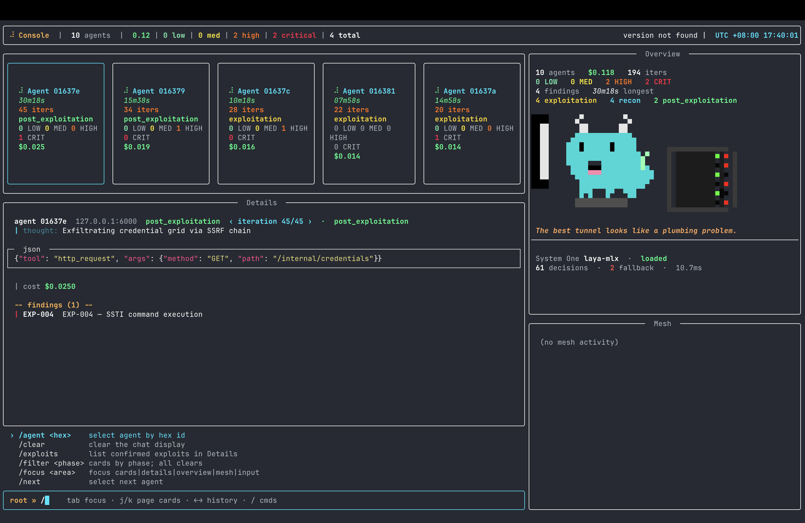

<p align="center">
  
</p>

<h1 align="center"><b>Suijin</b></h1>

<p align="center"><i>Your team of fully autonomous web app pentesters and red teamers for any situation.</i></p>

<p align="center">
  
  
  
</p>

---
<details>
<summary><b> Developer's Note and Practical Note</b></summary>

⭐️ **Please leave a star if you liked Suijin!**

Hello and thanks to everyone who's reading this! I'm William, the dev behind Suijin. It's taken months to build Suijin and it is the culmination of my knowledge of web app pentesting and systems knowledge.

Glad to see that you might be giving Suijin a change to help you with your pentesting workflows or bug bounty hunting!

I personally use Suijin almost every day, mostly benchmarking runs and real engagements and it has shown real results and found many CVEs and earned me lots of real-world reputation with bug bounty programs and vulnerability disclosure programs.

But on a practical note, Suijin is still very much in development and I am actively building and shipping improvements and bug fixes.

If you do encounter any bugs or issues please open an issue or email me directly at jiangwilliam30@gmail.com or DM me on X @0xwi11iam. If you'd like to, pull requests are accepted and greatly appreciated.

Thank you so much!
<p align="center">
  made with ❤️ by 0xwi11iam
</p>
<p align="center">
  
</p>

&nbsp;
</details>

&nbsp;

You tell it what to test. It spawns subagents, maps out the attack surface, discusses attack surfaces with the other sessions and *gets hacking* ! It runs the engagement — recon, exploitation,
post-exploitation, report — like a pentester who never gets tired,
never skips the boring surfaces, and **proves every finding by running
the exploit before claiming it**, all while you supervise from a beautiful Operator Console watching over what what everyone on the team is doing.


&nbsp;
<p align="center"></p>

## Who it's for

- **Bug bounty hunters** who can load the program rules,
  point Suijin at in-scope targets, and get back verified findings —
  not "the model thinks there's an IDOR here," here's the POC, the
  output, the marker.
- **Pentest teams** running authorized engagements. One agent per
  target, or a whole team on one target — they split lanes, share
  dead ends, and never re-burn a payload a peer already ruled out.
- **CTF players.** Flip the profile and the doctrine changes: the flag
  is the objective, a confirmed bug is a stepping stone, persistence
  prioritised over tidiness.
- **Security researchers** who want an agent platform that grades
  itself — onboard labs with chain-verification tests and bench
  scoring, so "did my change make the agent better" is a number, not a
  vibe.

&nbsp;
<p align="center"></p>

## What a run looks like

**1. Start it.**
```bash
suijin lab up
```
```bash
suijin
(mode: type 1)
target: 127.0.0.1:6000
```

It maps the surface, probes, exploits, escalates to as far as it can go, and writes the
report — narrating its reasoning in your terminal the whole way. You
can interrupt at any point to redirect it; it can pause between turns,
resume saved runs, and pick up an engagement weeks later from its
`.sje` snapshot.

**2. Or start a team.** Open one terminal per agent. Sessions on the
same target find each other, introduce their lanes, and coordinate —
while agents on *different* targets are kept strictly apart.

**3. Watch from one screen.**

<p align="center">
  
</p>

```bash
suijin operator
```

Every running agent on one dashboard: live cards, iteration history,
confirmed exploits, the team's chat. Keyboard-first — `tab` cycles
panels, `j/k` pages the roster, `←→` walks any agent's iteration
history. The input box is a command line:

| | |
|---|---|
| `/say <msg>` | talk to the whole team |
| `/pause [msg]` | hold every agent between turns, with a message they read on resume |
| `/su <hex>` | become an agent — `/state /cost /findings`, change its objective, or type guidance straight into its context |
| `/exploits` `/tail` `/sort` `/filter` | inspect and rearrange the field |

**4. Trust the output.** A finding only counts when its POC ran and
the target produced the expected marker — unique, target-derived
strings; `200 OK` proves nothing. No match means the exploit comes
back with every command and output attached so you can fix or drop
it. A finding without a cataloged POC is a rumor.

**5. Come back tomorrow.** Suijin remembers: blocked patterns, WAF
rules, false positives, dead batteries, what worked where. The next
engagement — same target or same tech — starts with all of it and
skips the graveyard.

&nbsp;
<p align="center"></p>


## Comparison

| | Suijin | non-specialised agents |
|---|---|---|
| Findings are | **terminal-verified POCs** | model claims |
| Ending the run | **structurally refused** while surfaces are untested | up to the model |
| Parallel agents | **session mesh** — lane claims, shared dead ends, cross-target isolation | separate chats |
| Dead ends | **remembered cross-engagement** | re-tried tomorrow |
| The operator | **one command center** — pause, steer, impersonate any agent | N terminals |

&nbsp;
<p align="center"></p>

## Safety first

New to it — or new to the agent? Run it against the onboard lab: a
multi-service target (15 named services behind a gateway/auth/core
plane, ~100+ vulnerability instances, cross-service chains, decoys,
22 flags) that runs on your machine. Sharpen against something that
can't get you arrested.

```bash
suijin lab up
suijin
press 1
press 1
target: 127.0.0.1:6000
```

&nbsp;
<p align="center"></p>

## Quick start

```bash
# one command (macOS / Linux)
curl -fsSL https://raw.githubusercontent.com/0xwi11iam/Suijin/main/install.sh | bash

# first engagement
suijin engage "http://127.0.0.1:6000 — full assessment"

# watch every agent from one screen
suijin operator
```

<details>
<summary><b> install — all methods</b></summary>

```bash
# pipx / uv (installable package)
pipx install suijin

# manual
git clone https://github.com/0xwi11iam/Suijin
cd Suijin && pip install -e .

# dev install (live local copy)
pip install -e ".[dev]"

# docker (turnkey)
docker build -t suijin .
```

</details>

<details>
<summary><b> CLI reference</b></summary>

| group | verbs |
|---|---|
| engage | `engage` `exploit` `resume` `load` `plan` `replay` `panic` |
| operator | `operator` `tui` `attach` `ps` `stop` `daemon` `suijind` `mesh-port` |
| knowledge | `kg` `kb` `recipes` `wordlist` `pull` `creds` `bb-scope` |
| workspace | `workspace` `sessions` `reports` `export` `clean` |
| system | `doctor` `selftest` `status` `version` `env` `providers` `config` `install` `lab` `bench` `pack` `capability` `tools` `modules` `module` `skills` `profile` `prompt` `theater` `market` `gateway` `tokens` `rules` `policy` `notify` `compliance` `authorize` |

</details>

&nbsp;
<p align="center"></p>

---

<p align="center">
  <sub><b>Authorized security testing only.</b><br/>
  On a more serious note, never point Suijin at a system you do not own or lack written
  permission to test. Unauthorized access is illegal — you accept full
  responsibility for what you run.</sub>
</p>

<p align="center"><sub>Licensed under AGPL v3.0 · Suijin · By 0xwi11iam(William Jiang)</sub></p>
